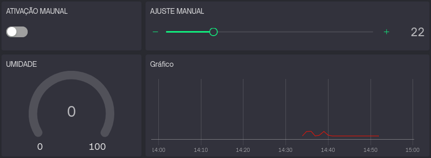
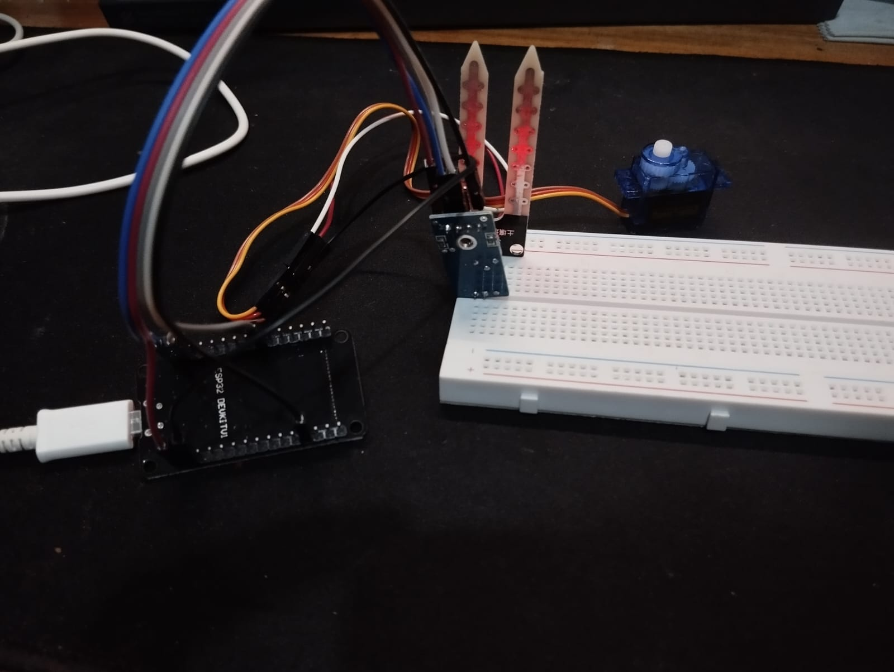

## 1. Documentação de Solução IoT para sistema de irrigação inteligente.
---

## 2. Nomes
- Artur & Gustavo

 ---
 
## 3. Histórico
 
| DATA | AUTOR | DESCRIÇÃO     |
|--------|-------|------------|
| 03/04/2026  | Artur e Gustavo    | Definição do tema, estudos sobre as tecnologias de software e hardware  |
| 06/04/2026 a 09/04/2026 |Gustavo| Elaboração do dispositivo no blynk, app mobile, automação e adição de tópicos no relatório |
| 10/04/2026  | Artur e Gustavo    | Elaboração do código inicial da ESP com Blynk (Controle de umidade, abertura/fechamento de bomba manual e automático), alteração nos casos de uso e diagrama de atividade  |
| 11/04/2026  | Artur e Gustavo    | Adição de informações, imagens e funcionamento do projeto ao relatório  |

---
		
## 4. Descrição

Este projeto apresenta um sistema de irrigação IoT que integra sensores de umidade ao microcontrolador via protocolo MQTT e plataforma Blynk. A solução automatiza a rega com base em dados em tempo real, permitindo controle remoto por dashboard web e aplicativo móvel. Os principais benefícios incluem a economia significativa de água, a saúde das plantas por monitoramento constante e a praticidade de uma automação que opera de forma independente, reduzindo a necessidade de intervenção humana manual.

Benefícios da Solução

---

## 5. Hardware Utilizado / Simulador

Microcontrolador: ESP32 (escolhido pelo Wi-Fi nativo e suporte robusto ao protocolo MQTT).

Sensor: Sensor de Umidade de Solo (Higrômetro).

Atuador: Servo Motor (simulando uma válvula de abertura de água).

Plataforma Cloud: Blynk IoT (atuando como Broker MQTT e servidor de aplicação).

---

## 6. Medidas Sensoreadas

Umidade do Solo: Mensurada em valores percentuais (0% a 100%), onde 0% representa solo totalmente seco e 100% solo saturado (água).

---

## 7. Sensores Utilizados
| Medida | Periodicidade da Coleta | Como ocorre a coleta | Sensor real a ser utilizado | Descrição da simulação |
| :--- | :--- | :--- | :--- | :--- |
| **Umidade do Solo** | A cada 5 segundos | Leitura analógica via pino ADC da ESP32 | Higrômetro Capacitivo | O valor de tensão lido é mapeado de 0-4095 para uma escala percentual de 0% a 100% no dashboard. |

---

## 8. Funcionamento da Simulação (Sensores)
Sensor de Umidade: O sensor detecta a condutividade/capacitância do solo. 

A simulação da umidade é visualizada através de widgets de Gráfico (Chart) e Medidor (Gauge). Para fins de teste e validação da lógica de irrigação, o sistema monitora se o valor enviado pelo sensor está abaixo do limite (setpoint) configurado no slider, disparando alertas visuais no dashboard sempre que o solo é classificado como 'seco'.

O valor analógico bruto do sensor (**0** a **4095**) é processado via função map(), convertendo a tensão em uma escala percentual linear de umidade, facilitando a interpretação do usuário final

---

## 9. Atuações Realizadas

As atuações do sistema consistem no controle físico do fluxo de água (simulado pelo servo motor) e no feedback de status para o usuário. As ações são divididas em duas modalidades:

**9.1. Atuação Automática (Controle por Setpoint)**
Descrição: O sistema compara a leitura atual do sensor com o limite definido pelo usuário no Slider (V3).

Ação: Se a umidade lida for inferior ao limite estabelecido, o sistema aciona o servo motor para a posição de 80° (Aberto). Ao atingir a meta, o servo retorna para 10° (Fechado).

Diferencial: Implementação de histerese via software, garantindo que o motor só mude de posição quando houver uma alteração real na necessidade hídrica, evitando acionamentos intermitentes.

**9.2. Atuação Manual (Controle Forçado)**
Descrição: Sobreposição dos comandos automáticos através do botão Switch (V2) no Dashboard.

Ação: Permite a abertura ou fechamento imediato da válvula para manutenção ou testes, independentemente da umidade lida pelo sensor.

**9.3. Gestão de Energia e Sinal (Proteção do Atuador)**
Descrição: Gerenciamento do sinal PWM enviado ao servo.

Ação: Uso da técnica de Detaching, onde o sinal de controle é interrompido após a conclusão do movimento. Isso elimina a vibração (jitter) e evita o superaquecimento do motor em períodos de repouso.

---

## 10. Atuadores Utilizados
| Atuação | Quando ocorre | Como ocorre a atuação | Atuador real a ser utilizado | Descrição da atuação |
| :--- | :--- | :--- | :--- | :--- |
| **Irrigação** | Umidade < Limite | Ativação via sinal PWM | Servo Motor SG90 | O servo rotaciona o eixo em 90° para simular a abertura de uma válvula de água. |

---

## 11. Funcionamento da Simulação (Atuadores)

O atuador (Servo Motor) responde a três estados lógicos distintos e intertravados:

Comando Manual Forçado (V2): Acionamento direto via Switch no dashboard, que ignora a leitura do sensor para manutenções rápidas.

Automação por Setpoint (V3): O usuário define a meta de umidade via Slider. O sistema calcula o erro entre a umidade atual e a desejada para decidir o acionamento.

Lógica de Intertravamento: Sistema de segurança via software que impede que comandos manuais e automáticos entrem em conflito, garantindo a estabilidade do atuador.

---

## 12. Casos de Uso (UML)

**Caso 1: Monitoramento Remoto**

Ator: Usuário (Agricultor).

Descrição: O usuário abre o App Blynk e visualiza o gráfico de umidade em tempo real via protocolo MQTT.

Fluxo Normal:
- O usuário acessa o dashboard.
- O usuário visualiza o gráfico de umidade em tempo real.

**Caso 2: Ajuste de Setpoint (Configuração)**

Ator: Usuário.

Descrição: O usuário move o Slider no dashboard para definir que a planta deve ser regada quando a umidade atingir 40% (em vez do padrão 30%).

Fluxo Normal:
- O usuário acessa o dashboard.
- O usuário ajusta o Slider para 40%.
- O novo valor é publicado via MQTT para o microcontrolador.

---
## 13. Caso de Uso Escolhido (Implementado)

Nome: Irrigação Inteligente com Intertravamento de Segurança.

Descrição: O sistema integra a leitura em tempo real com uma meta definida pelo usuário. A inovação está na proteção lógica: o usuário tem controle total (manual), mas ao ativar a automação, o sistema protege a planta garantindo que a irrigação só ocorra se a umidade real estiver abaixo do limite configurado, impedindo o acionamento acidental pelo botão manual enquanto a automação está ativa.

---

## 14. Diagrama de Atividade (UML)

---

## 15. Diagrama de Sequência (UML)

Fluxo: Sensor Higrômetro $\rightarrow$ ESP32 (ADC) $\rightarrow$ Lógica de Comparação (Setpoint) $\rightarrow$ Publicação MQTT (Tópico ds/umidade) $\rightarrow$ Dashboard Blynk (Atualização do Gauge V1) $\rightarrow$ Acionamento Servo (PWM).

---

## 16. Implementação

### Dashboard Web

O dashboard web contém as seguintes funções:
- Ativação manual da bomba: Força ela estar ligada, apenas funciona quando o ajuste manual está em 0%
- Ajuste manual: Define a porcentagem desejada da umidade, fazendo a bomba ligar quando estiver abaixo do limite definido, apenas funciona quando o ajuste manual está desligado.

- Medidor de umidade: Mostra a porcentagem atual da umidade do solo, atualizada em tempo real via MQTT.
- Gráfico de histórico de umidade: Exibe a evolução da umidade ao longo do tempo

### Montagem

A montagem do projeto se constitiu nos seguintes componentes:
- ESP32: Microcontrolador central que processa as leituras do sensor e controla o atuador.
- Sensor de Umidade: Para leitura analógica da umidade do solo.
- Servo Motor: Simular a abertura/fechamento da válvula de água.

---

## 17. Implementações Extras

- Protocolo MQTT Nativo: Implementação da biblioteca PubSubClient para envio de telemetria independente da interface Blynk.

- Intertravamento de Software (Software Interlocking): Lógica que impede o acionamento do Slider se o Botão Manual estiver ativo e vice-versa.

- Feedback Personalizado via Serial: Sistema de mensagens dinâmicas no console que confirma ao usuário a configuração exata da meta de umidade escolhida.

- Filtro de Ruído Digital: Implementação de um timer para ajudar a estabilizar a leitura do sensor analógico de umidade.

- Algoritmo de Auto-Recuperação (Watchdog de Conexão): Implementação de rotina de reconexão automática ao Broker MQTT, garantindo que o sistema retome o envio de dados sem necessidade de reset físico após quedas de rede.
