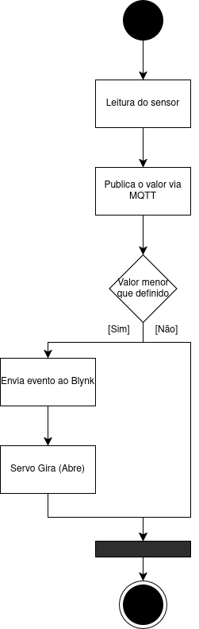

## 1. Documentação de Solução IoT para sistema de irrigação inteligente.
---

## 2. Nomes
- Artur & Gustavo

 ---
 
## 3. Histórico
 
| DATA | AUTOR | DESCRIÇÃO     |
|--------|-------|------------|
| 03/04/2026  | Artur e Gustavo    | Definição do tema, estudos sobre as tecnologias de software e hardware  |
| 06/04/2026 a 09/04/2026 |Gustavo| Elaboração do dispositivo no blynk, app mobile, automação e adição de tópicos no relatório |

---
		
## 4. Descrição

Este projeto apresenta um sistema de irrigação IoT que integra sensores de umidade ao microcontrolador via protocolo MQTT e plataforma Blynk. A solução automatiza a rega com base em dados em tempo real, permitindo controle remoto por dashboard web e aplicativo móvel. Os principais benefícios incluem a economia significativa de água, a saúde das plantas por monitoramento constante e a praticidade de uma automação que opera de forma independente, reduzindo a necessidade de intervenção humana manual.

Benefícios da Solução

---

## 5. Hardware Utilizado / Simulador

Microcontrolador: ESP32 (escolhido pelo Wi-Fi nativo e suporte robusto ao protocolo MQTT).

Sensor: Sensor de Umidade de Solo (Higrômetro).

Atuador: Servo Motor (simulando uma válvula de abertura de água).

Plataforma Cloud: Blynk IoT (atuando como Broker MQTT e servidor de aplicação).

---

## 6. Medidas Sensoreadas

Umidade do Solo: Mensurada em valores percentuais (0% a 100%), onde 0% representa solo totalmente seco e 100% solo saturado (água).
---

## 7. Sensores Utilizados
| Medida | Periodicidade da Coleta | Como ocorre a coleta | Sensor real a ser utilizado | Descrição da simulação |
| :--- | :--- | :--- | :--- | :--- |
| **Umidade do Solo** | A cada 5 segundos | Leitura analógica via pino ADC da ESP32 | Higrômetro Capacitivo | O valor de tensão lido é mapeado de 0-4095 para uma escala percentual de 0% a 100% no dashboard. |

---

## 8. Funcionamento da Simulação (Sensores)
Sensor de Umidade: O sensor detecta a condutividade/capacitância do solo. 

A simulação da umidade é visualizada através de widgets de Gráfico (Chart) e Medidor (Gauge). Para fins de teste e validação da lógica de irrigação, o sistema monitora se o valor enviado pelo sensor está abaixo do limite (setpoint) configurado no slider, disparando alertas visuais no dashboard sempre que o solo é classificado como 'seco'.

---

## 9. Atuações Realizadas

---

## 10. Atuadores Utilizados
| Atuação | Quando ocorre | Como ocorre a atuação | Atuador real a ser utilizado | Descrição da atuação |
| :--- | :--- | :--- | :--- | :--- |
| **Irrigação** | Umidade < Limite | Ativação via sinal PWM | Servo Motor SG90 | O servo rotaciona o eixo em 90° para simular a abertura de uma válvula de água. |

---

## 11. Funcionamento da Simulação (Atuadores)
Para contornar as limitações de automação em nuvem da versão gratuita, utilizamos o widget Time Input no pino virtual V4. Este componente permite que o usuário envie um cronograma completo de irrigação para o microcontrolador via MQTT. O ESP32 recebe esses parâmetros e os armazena em sua memória local.

O atuador (Servo Motor) responde a dois gatilhos distintos:

Comando Manual: Via botão (Switch) no dashboard ou aplicativo.

Comando Programado: Via lógica de tempo processada pelo microcontrolador a partir dos dados recebidos pelo widget Time Input (V4). O funcionamento é validado pela mudança de estado do pino virtual V2 na interface."

---

## 12. Casos de Uso (UML)

**Caso 1: Monitoramento Remoto**

Ator: Usuário (Agricultor).

Descrição: O usuário abre o App Blynk e visualiza o gráfico de umidade em tempo real via protocolo MQTT.

Fluxo Normal:
- O usuário acessa o dashboard.
- O usuário visualiza o gráfico de umidade em tempo real.

**Caso 2: Ajuste de Setpoint (Configuração)**

Ator: Usuário.

Descrição: O usuário move o Slider no dashboard para definir que a planta deve ser regada quando a umidade atingir 40% (em vez do padrão 30%).

Fluxo Normal:
- O usuário acessa o dashboard.
- O usuário ajusta o Slider para 40%.
- O novo valor é publicado via MQTT para o microcontrolador.

---
## 13. Caso de Uso Escolhido (Implementado)
Nome: Irrigação Inteligente com Agendamento Flexível.
Descrição: O sistema integra a leitura de umidade com um cronograma horário. O usuário define a janela de funcionamento (ex: das 18h às 18h30) no App. O sistema só ativa o servo se, dentro desse horário, a umidade estiver abaixo do limite. Isso evita o desperdício de água em horários de sol forte e garante que a planta só receba água se realmente precisar.
---

## 14. Diagrama de Atividade (UML)

---

## 15. Diagrama de Sequência (UML)
O fluxo segue esta ordem:
Sensor -> ESP32 -> (MQTT Publish) -> Blynk Broker -> (Update Dashboard) -> Automação Blynk -> (MQTT Publish) -> ESP32 -> Servo Motor.
---

## 16. Implementação

Inserir screenshots dos dashboards desenvolvidos, com comentários explicando cada parte.

---

## 17. Implementações Extras

Sincronização de Tempo via NTP: "Implementamos a lógica de consulta a servidores de tempo (Network Time Protocol) para que o microcontrolador mantenha o relógio atualizado via internet, permitindo que o agendamento do usuário seja preciso."

Interface Multiplataforma: "A solução foi desenvolvida para operação híbrida, onde o monitoramento pesado é feito via Dashboard Web e o controle operacional/agendamento é realizado via App Mobile, otimizando a experiência do usuário."

Resiliência de Operação: "Ao processar a lógica de tempo localmente no hardware (recebendo os dados do V4), garantimos que o sistema seja menos dependente de latências da nuvem para a execução de tarefas críticas."
